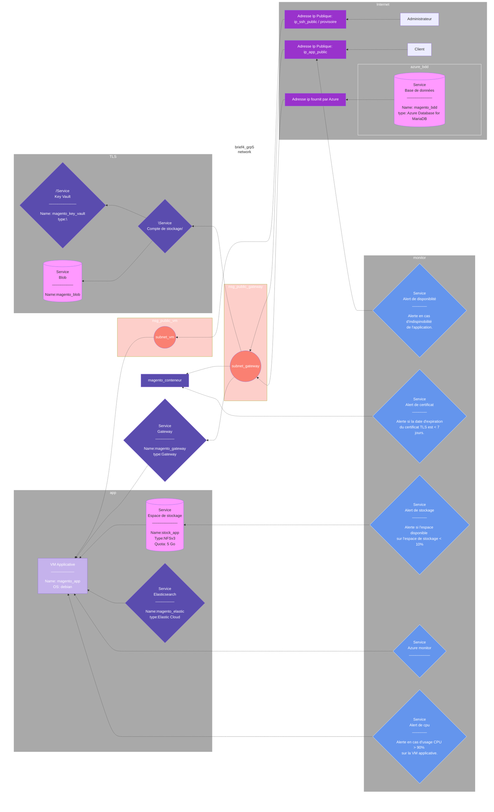

Brief 4 Groupe 5
===

### Liste des ressources.

| Type                   | Nom               | Caractéristiques               |
| ---------------------- | ----------------- | ------------------------------ |
| Azure resource group   | brief4_grp5       | Location                       |
| Azure Network          | network_azure     |                                |
| Azure Subnet           | subnet_vm         |                                |
| Azure Subnet           | subnet_gatway     |                                |
| Azure Virtual machine  | vm_app            | Linux (Ubuntu) 2 GO min        |
| network interface      | ip_ssh_public     | provisoire(VM)                 |
| network interface      | ip_app_public     | gateway                        |
| Network security group |                   |                                |
| Azure Database         | stock_app         |                                |
| Azure Storage Account  |                   | NFSv3 quota 5GO                |
| Azure Storage Account  |                   | Key Vault                      |
| Azure Gateway          |                   |                                |
| Azure Key Vault        | magento_key_vault |                                |

### Stratégie de scaling

Stratégie horizontal avec le groupe de VM identiques azure en fonction des métrique de type CPU et RAM
### Test de Métrique de monitoring

RAM
Indisponibilité (HTTP status code/alerte)
CPU (Charge > 90 %)
TLS (Certificat < 7 jours /alerte)
Stockage (capacité < 10% /alerte )
### Plan de test de charge

Test d'ajout d'utilisateur (suppression/modification)
test ajout produit catalogue
Test de requete de liste produit
### Politique de backup

Une sauvagarde par jour avec une rétention de 7 jours consécutifs
Politique de Backup Incrémental

### Tâches à faire:

###### 0. Préparation.

- [x] ==1== Préparer un plan projet
- [x] ==2== Créer un projet Github
- [x] ==3== Créer un projet Github associé au projet
- [x] ==4== Reporter la liste des tâches dans le Kanban

###### 1. Déploiement d'une infra minimale.

- [ ] ==1== Déployer un resource group
- [ ] ==2== Déployer un vnet
- [ ] ==3== Déployer un subnet
- [ ] ==4== Déployer une IP publique avec une étiquette DNS
- [ ] ==5== Déployer une VM linux
- [ ] ==6== Se connecter en SSH sur la VM

###### 2. Déploiement d'une base de données.

- [ ] ==1== Déployer une instance ()
- [ ] ==2== Créer une règle firewall pour autoriser la VM application
- [ ] ==3== Installer sur la VM la paquet () et tester la connection à la base de données

###### 3. Déploiement d'un espace de stockage.

- [ ] ==1== Créer un compte de stockage
- [ ] ==2== Créer un groupe de stockage NFSv3 avec un quota de 5 Go
- [ ] ==3== Ajouter une règle ACL pour autoriser la VM applicative
- [ ] ==4== Installer sur la VM applicative le paquet nfs-common et tester le montage de l'espace de stockage

###### 4. Déploiement du service elastic cloud

- [ ] ==1== Création du service
- [ ] ==2== Configuration du service

###### 5. Script cloud-init.

- [ ] ==1== Implémenter un script cloud-init qui installe et configure l'application choisie
- [ ] ==2== Déployer l'application gateway en utilisant l'adresse IP publique de la VM applicative. Le backend est la VM applicative.

###### 6. Mise en place de TLS.

- [ ] ==1== Créer un subnet dédié
- [ ] ==2== Déployer l'application gateway en utilisant l'adresse IP publique de la VM applicative. Le backend est la VM applicative

###### 7. Mise en place de TLS.

- [ ] ==1== Créer un Azure Kay Vault
- [ ] ==2== Créer un compte de stockage public
- [ ] ==3== Créer un conteneur
- [ ] ==4== Dans ce conteneur, créer un chemin “/.well-known/acme-challenge”
- [ ] ==5== Créer un blob avec un contenu aléatoire dans ce chemin
- [ ] ==6== Configurer une règle de chemin sur l’Application gateway qui redirige “/.well-known/acme-challenge/*” vers le conteneur
- [ ] ==7== Tester l’URL depuis un navigateur web
- [ ] ==8== Implémenter un script qui :
- crée un certificat via Certbot avec le challenge http-01
- qui crée un blob dans le conteneur avec le bon nom et le bon contenu pour résoudre le challenge.
- Ajoute le certificat dans le vault
- [ ] ==9== Vérifier via votre navigateur que le site est bien considéré comme sûr

###### 7. Monitoring de l'application.

- [ ] ==1== Activer le monitoring de la VM dans Azure Monitor
- [ ] ==2== Activer le cas échéant le monitoring de la base de données et/ou de l’espace de stockage dans Azure Monitor
- [ ] ==3== Activer le monitoring de l’application dans Azure Monitor
- [ ] ==4== Créer un workbook (classeur) avec les métriques pertinentes à suivre pour vos ressources et votre aplication
- [ ] ==5== Créer une alerte en cas d’indisponibilité de l’application
- [ ] ==6== Créer une alerte en cas d’usage CPU > 90% sur la VM applicative
- [ ] ==7== Créer une alerte si la date d’expiration du certificat TLS est < 7 jours
- [ ] ==8== Créer une alerte si l’espace disponible sur l’espace de stockage < 10%
- [ ] ==9== Configurer les alertes pour envoyer des emails à votre groupe et aux formateurs

###### 8. Script de test de montée en charge.

- [ ] ==1== Implémenter un script qui effectue des requêtes HTTP à l’application de manière massive et rapide.
- [ ] ==2== Constater l’impact du script sur l’usage des ressources de la VM applicative.

###### 9. Backup.

- [ ] ==1== Créer un backup de l’espace de stockage le cas échéant
- [ ] ==2== Créer un backup de la base de données le cas échéant
- [ ] ==3== Supprimer des données dans la base et/ou dans l’espace de stockage
- [ ] ==4== Vérifier que l’application ne fonctionne plus
- [ ] ==5== Attendre 10 minutes
- [ ] ==6== Restaurer le backup
- [ ] ==7== Vérifier que l’application fonctionne à nouveau
- [ ] ==8== Vérifier que la défaillance apparaît dans Azure Monitor

###### 10. Scale set.

- [ ] ==1== Créer un VM scale set pour la VM applicative
- [ ] ==2== Exécuter un scale out de 8 replica
- [ ] ==3== Exécuter le test de montée en charge
- [ ] ==4== Constater l’impact du test sur les VMs
- [ ] ==5== Exécuter un scale in de 2 replica
- [ ] ==6== Exécuter le test de montée en charge
- [ ] ==7== Constater l’impact du test sur les VMs

###### 11. Auto scale

- [ ] ==1== Configurer le profile d’autoscale du scale set
- [ ] ==2== Créer une règle de scale out
- [ ] ==3== Créer une règle de scale in
- [ ] ==4== Exécuter le test de montée en charge
- [ ] ==5== Constater l’impact du test sur les VMs

