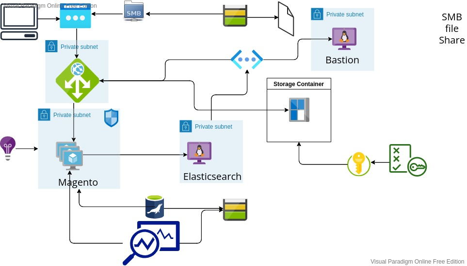

# 1. Introduction.
**Magento.**
**Azure.**
**Terraform.**
*Mise en place par Quentin, Ryan, et Stephane.*

---
# Sommaire
* 1 Introduction.
* 2 Missions.
* 3 Objectifs.
* 4 Scale set.
* 5 Test de charge.
* 6 Terraform.

---
# 2. Mission.
* Concevoir une infrastructure sécurisée, résiliente et scalable
* Utiliser Terraform et Ansible pour déployer
* Créer un Scale set pour configurer le scaling
* Monitorer l’application et ses ressources
* Sauvegarder les données de l’application
* Implémenter un script de test de charge
* Expérimenter le scaling
* Rédiger les documentations et présentations

---
# 3. Objectifs.
## 3.1 Managements.
* Mieux anticipé vos actions que dans le brief précédent
* Pratiqué Scrum
* Abordé la gestion de projet
* Abordé la communication en équipe
* Subir le travail des autres
* Documenté votre travail
* Présenté votre travail

---
# 3. Objectifs.
## 3.2 Techniques.
* Déployé de nouvelles ressources dans Azure
* Implémenté des scripts
* Utilisé Terraform
* Utilisé Ansible
* Ecrit du YAML

---
# 3. Objectifs.
## 3.2 Techniques.
* Utilisé certbot pour déployer un certificat TLS
* Sauvegardé les données applicatives
* Monitoré l’application et la VM
* Configuré de l’alerting
* Scalé une application

---
# 3. Topologie infrastructure.

---
# 4. Scale set
* Utilisation d'une ressource azure qui permet de scale set.
* Probléme lors du scale set avec l'application magento:
    * Problème:
      * Base de donnée réinstaller à chaque fois.
    * Solution
      * Utilisation de mysqldump pour sauvegarder la base donnée
      * Mysqldump dans la vm élastic search pour hydrater la base de donnée.

---
# 5. Test de charge
* Utilisation de python.
* Utilisation de l'api rest en json de magento.
* Probléme de scale lors du test de charge:
  * VM Magento monte en charge lors de l'installation de l'application.
    * Scale immédiatement en boucle.
  * Utilisation d'une image de vm pour eviter l'installation de l'application.
  * Mise en place d'un délai avant le scale.

---
# 6. Terraform
Terraform est un outil open source d'infrastructure as code (IaC) créé par hashicorp.

Terraform permet d'utiliser un langage de configuration qui décrit l'infrastructure cloud
pour l'exécution d'une application avec son état final.(Déclaratif)

Avantages : Il utilise un syntaxe simple, il utilise un provider Azure ,
terraform facilite le changement de configuration.(il garde une trace de l'état du code avant modification que l'on peu manipuler)
La documentation est facile d'accés et bien faite dans l'ensemble.